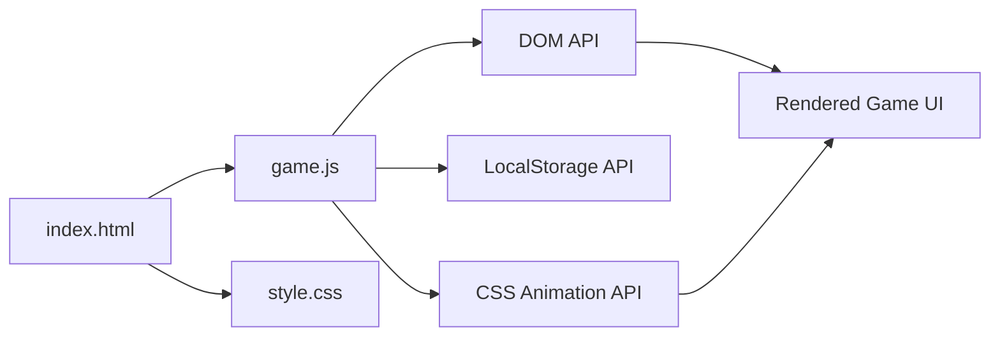

# ADR 0001 - Adopt vanilla JavaScript with no UI framework

## Context and Problem Statement

Cosmic Wimpout is a pass-and-play dice game targeting mobile browsers. The application requires dice rolling animations (Cascading Style Sheets (CSS) keyframes plus Scalable Vector Graphics (SVG) transitions), Document Object Model (DOM) manipulation for game state display, and event handling for touch interactions. A decision is needed on whether to adopt a UI framework (React, Vue, Svelte, etc.) or implement the application in vanilla JavaScript.

The codebase contains a single `game.js` file that implements all game logic, rendering, animation orchestration, and state management without any runtime dependencies beyond the browser platform Application Programming Interfaces (APIs). See `game.js:1-2062@53dbd761848d1653ec877e5d2c303d1a9f9eed4a`.

## Decision Drivers

- Zero-dependency deployment to GitHub Pages (static files only, no build step). Evidence: `package.json` lists no `dependencies` key for a UI framework (`package.json:1-35@53dbd761848d1653ec877e5d2c303d1a9f9eed4a`).
- Full control over dice animation timing (CSS keyframes, stagger delays, SVG face transitions) without framework reconciliation interference. Evidence: `game.js` defines `TUMBLE_MS = 650`, `STAGGER_MS = 60`, and `REVEAL_TRANSITION_MS = 220` as constants used with `setTimeout` (`game.js:10-12@53dbd761848d1653ec877e5d2c303d1a9f9eed4a`).
- Single developer maintaining the codebase; framework learning curve and upgrade churn are cost without proportional benefit at this scale. Evidence: repository commit history shows a single contributor.
- Application payload is `game.js` at 73,230 bytes uncompressed (measured via `wc -c game.js` at commit `53dbd76`, 2026-05-13). No additional JavaScript runtime is shipped.

## Considered Options

- Vanilla JavaScript (no framework)
- React with Create React App or Vite
- Svelte (compiled, low runtime overhead)
- Preact (lightweight React-compatible alternative)

## Decision Outcome

Chosen option: **"Vanilla JavaScript (no framework)"**, because the application is a self-contained single-page game with no routing, no server-side data fetching, and no component reuse across projects. The DOM interaction surface is small enough that manual element references and event listeners remain readable. Eliminating a build toolchain keeps the deployment pipeline trivial (upload static files) and removes a class of supply-chain risk.

### Consequences

- Good, because the application ships zero runtime JavaScript dependencies; `game.js`, `style.css`, and `index.html` are served directly without transpilation or bundling.
- Good, because animation timing constants are controlled directly via `setTimeout` and CSS class toggling without competing with a virtual DOM diffing cycle.
- Bad, because all UI logic resides in a single file of 2,062 lines (measured via `wc -l game.js` at commit `53dbd76`, 2026-05-13); as feature count grows, the lack of component boundaries increases the risk of coupling between unrelated subsystems.
- Bad, because there is no templating abstraction; HyperText Markup Language (HTML) structure is split between `index.html` (static scaffold) and string literals in `game.js` (dynamic dice faces via `FACE_SVGS`), making layout changes error-prone.

### Confirmation

- [ ] Static check: `package.json` lists no runtime `dependencies` that provide a UI framework (React, Vue, Svelte, Angular, Preact, Lit).
- [ ] Bundle check: the deployed artifact contains only `index.html`, `style.css`, `game.js`, and `favicon.svg` with no transpiled or bundled output.

## Pros and Cons of the Options

### Option - Vanilla JavaScript (no framework)

Implement all game logic, rendering, and state management using browser-native APIs (`document.querySelector`, `addEventListener`, `classList`, `localStorage`).

- Good, because zero build step; files are deployable as-is. Evidence: `.github/workflows/deploy.yml` uploads the repo root directly (`deploy.yml:56-58@53dbd76`).
- Good, because total JavaScript payload is a single file at 73,230 bytes uncompressed (measured via `wc -c game.js` at commit `53dbd76`, 2026-05-13).
- Good, because direct DOM access provides deterministic animation timing.
- Bad, because no component model; large-scale refactoring requires manual extraction.
- Bad, because no declarative UI; state-to-DOM synchronisation is imperative and manual.

### Option - React with Create React App or Vite

Adopt React for component-based UI with JavaScript Syntax Extension (JSX) templating.

- Good, because component boundaries enforce separation of concerns.
- Good, because large ecosystem of reusable UI libraries. Source: <https://www.npmjs.com/search?q=react>.
- Bad, because introduces a build step (Webpack/Vite), increasing Continuous Integration (CI) complexity.
- Bad, because React's reconciliation cycle may interfere with frame-precise CSS animation timing.
- Bad, because runtime bundle size for React plus ReactDOM adds a dependency that exceeds the current application's total JavaScript payload. Source: <https://bundlephobia.com/package/react-dom@18.2.0>.

### Option - Svelte (compiled, low runtime overhead)

Adopt Svelte for compiled components with minimal runtime.

- Good, because compiled output is small and framework runtime is near-zero. Source: <https://svelte.dev/blog/frameworks-without-the-framework>.
- Good, because reactive declarations simplify state-to-DOM binding.
- Bad, because still requires a build step and Node.js toolchain.
- Bad, because smaller community compared to React; fewer dice/game-specific libraries.

### Option - Preact (lightweight React-compatible alternative)

Adopt Preact as a lightweight React-compatible alternative.

- Good, because API-compatible with React at a fraction of the bundle size. Source: <https://preactjs.com/>.
- Bad, because still requires JSX transpilation and a build step.
- Bad, because animation timing concerns from virtual DOM diffing persist.

## Diagram

## More Information

- Evidence: `game.js` line 1 declares `"use strict"` and uses no `import`/`require` statements for framework modules (`game.js:1@53dbd76`).
- Evidence: `package.json` contains only `devDependencies` (Jest); no runtime framework dependency (`package.json:9-12@53dbd76`).
- Evidence: `.github/workflows/deploy.yml` uploads the repo root directly to GitHub Pages without a build step (`deploy.yml:54-58@53dbd76`).
