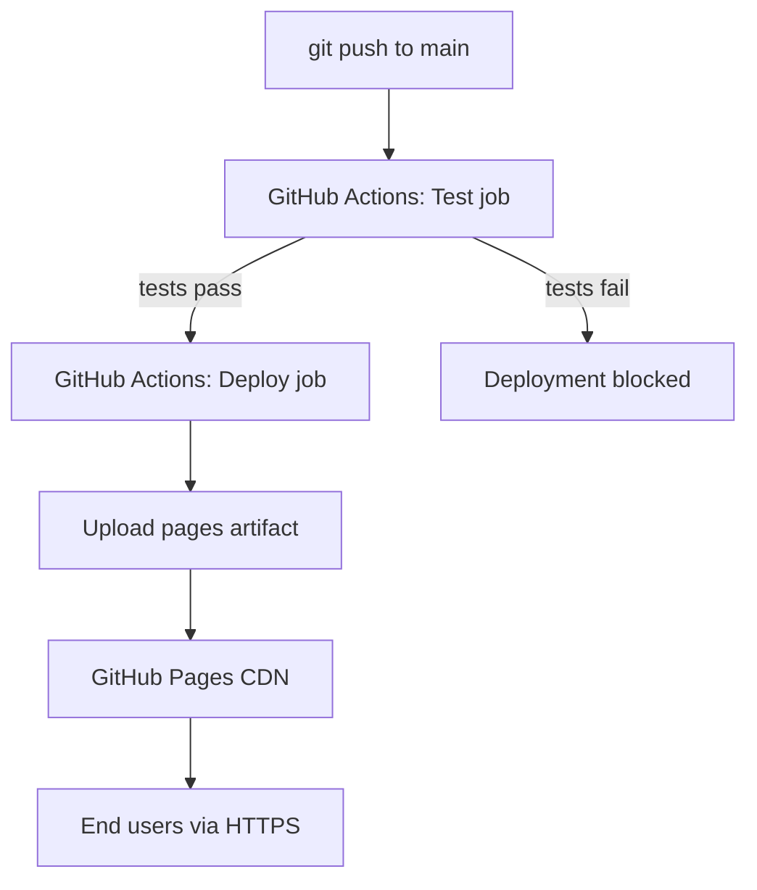

# ADR 0002 - Deploy as a static site to GitHub Pages

## Context and Problem Statement

Cosmic Wimpout is a client-side-only dice game with no server-side logic, no database, and no Application Programming Interface (API) calls. A hosting solution is needed that serves static files (HyperText Markup Language (HTML), Cascading Style Sheets (CSS), JavaScript (JS), Scalable Vector Graphics (SVG)) with HyperText Transfer Protocol Secure (HTTPS), a Content Delivery Network (CDN), and zero operational overhead. The project is hosted on GitHub, making GitHub Pages a natural candidate.

## Decision Drivers

- Zero operational cost for a hobby/open-source project. Evidence: GitHub Pages is free for public repositories. Source: <https://docs.github.com/en/pages/getting-started-with-github-pages/about-github-pages>.
- HTTPS by default with automatic certificate management. Source: <https://docs.github.com/en/pages/getting-started-with-github-pages/about-github-pages#types-of-github-pages-sites>.
- Deployment triggered automatically on push to `main`, gated by test passage. Evidence: `.github/workflows/deploy.yml` defines a `needs: test` dependency on the deploy job (`deploy.yml:40@53dbd76`).
- No server-side runtime required; the application is entirely client-side (see Architecture Decision Record (ADR) 0001).

## Considered Options

- GitHub Pages with GitHub Actions Continuous Integration/Continuous Deployment (CI/CD)
- Netlify
- Vercel
- Self-hosted (Virtual Private Server (VPS) with Nginx)

## Decision Outcome

Chosen option: **"GitHub Pages with GitHub Actions CI/CD"**, because the project is already hosted on GitHub, the deployment requires no build step, and the GitHub Actions workflow provides a test gate before deployment. The `deploy.yml` workflow runs Jest tests, then uploads the repo root as a Pages artifact on the `main` branch. Evidence: `deploy.yml:39-63@53dbd76`.

### Consequences

- Good, because deployment is free, automatic, and requires no external service accounts or credentials beyond the repository's built-in `GITHUB_TOKEN`.
- Good, because the CI pipeline gates deployment on test passage (`needs: test`), preventing broken builds from reaching production. Evidence: `deploy.yml:40@53dbd76`.
- Good, because the concurrency configuration (`cancel-in-progress: false`) prevents half-deployed states. Evidence: `deploy.yml:15-17@53dbd76`.
- Bad, because GitHub Pages does not support server-side logic; if the game later requires a backend (e.g., multiplayer, leaderboards), a separate hosting solution would be needed.
- Bad, because GitHub Pages imposes a soft bandwidth limit and repository size limit per the published usage limits. Source: <https://docs.github.com/en/pages/getting-started-with-github-pages/about-github-pages#usage-limits>.

### Confirmation

- [ ] Deployment check: pushing a commit to `main` triggers the `Test & Deploy to GitHub Pages` workflow and the site is accessible at the configured GitHub Pages URL.
- [ ] Gate check: a failing test in `__tests__/` prevents the deploy job from running.

## Pros and Cons of the Options

### Option - GitHub Pages with GitHub Actions CI/CD

Serve static files directly from the GitHub repository using the built-in Pages infrastructure, triggered by a GitHub Actions workflow.

- Good, because zero cost and zero external dependencies. Source: <https://docs.github.com/en/pages/getting-started-with-github-pages/about-github-pages>.
- Good, because deployment is a single `git push` with automatic test gating. Evidence: `deploy.yml:1-63@53dbd76`.
- Good, because HTTPS and CDN are provided by default.
- Bad, because limited to static content; no server-side rendering or API routes.
- Bad, because custom domain configuration requires Domain Name System (DNS) changes outside GitHub.

### Option - Netlify

Deploy to Netlify's CDN with automatic builds on push.

- Good, because supports serverless functions for future backend needs. Source: <https://docs.netlify.com/functions/overview/>.
- Good, because provides deploy previews for pull requests.
- Bad, because introduces an external service dependency and account management.
- Bad, because the free tier has build-minute limits that may become relevant with frequent pushes.

### Option - Vercel

Deploy to Vercel's edge network with automatic builds.

- Good, because supports edge functions and server-side rendering if needed later. Source: <https://vercel.com/docs/functions>.
- Bad, because Vercel is optimised for Next.js; a vanilla HTML/CSS/JS project gains little from the platform.
- Bad, because introduces an external service dependency.

### Option - Self-hosted (VPS with Nginx)

Provision a virtual private server and serve static files via Nginx.

- Good, because full control over server configuration, caching headers, and domain routing.
- Bad, because introduces operational overhead (operating system patching, Transport Layer Security (TLS) renewal, uptime monitoring).
- Bad, because non-zero hosting cost for a project that requires no server-side logic.

## Diagram

## More Information

- Evidence: `.github/workflows/deploy.yml` defines a two-job pipeline (test, deploy) triggered on pushes to `main` (`deploy.yml:1-5@53dbd76`).
- Evidence: The deploy job uses `actions/upload-pages-artifact@v3` with `path: .`, confirming no build step is required (`deploy.yml:54-58@53dbd76`).
- Evidence: Concurrency group `pages` with `cancel-in-progress: false` prevents partial deployments (`deploy.yml:15-17@53dbd76`).
