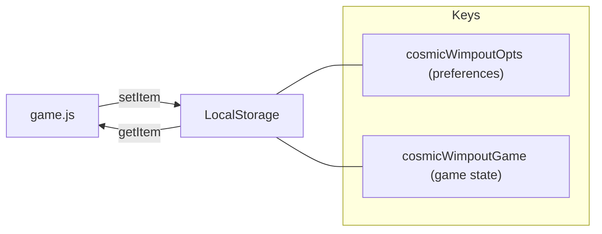

# ADR 0003 - Use LocalStorage for client-side game state persistence

## Context and Problem Statement

Cosmic Wimpout needs to persist two categories of data across browser sessions: user preferences (theme colours, dice styles, player names) and in-progress game state (scores, current turn, dice values). The application has no server-side component (see Architecture Decision Record (ADR) 0001), so persistence must be handled entirely in the browser. A storage mechanism is needed that is synchronous, simple to use, and available in all target mobile browsers.

## Decision Drivers

- No server-side component exists; all persistence is client-side (see ADR 0001).
- Data volume is small; the two JavaScript Object Notation (JSON) objects stored (`cosmicWimpoutOpts` and `cosmicWimpoutGame`) serialize to under a few kilobytes in practice. Evidence: `game.js:14-15@53dbd76` defines the two storage keys.
- Synchronous read/write is acceptable; game state updates are infrequent (once per turn action, not per animation frame).
- Target browsers (modern mobile Chrome, Safari, Firefox) all support the Web Storage Application Programming Interface (API). Source: <https://developer.mozilla.org/en-US/docs/Web/API/Web_Storage_API#browser_compatibility>.

## Considered Options

- LocalStorage (Web Storage API)
- IndexedDB
- HyperText Transfer Protocol (HTTP) Cookies
- No persistence (ephemeral sessions)

## Decision Outcome

Chosen option: **"LocalStorage (Web Storage API)"**, because the data model is two small JSON objects (preferences under `STORAGE_KEY = "cosmicWimpoutOpts"` and game state under `GAME_STATE_KEY = "cosmicWimpoutGame"`), the API is synchronous and requires no async/await boilerplate, and browser support is universal across the target platforms. Evidence: `game.js:14-15@53dbd76`.

### Consequences

- Good, because the API is two calls (`localStorage.getItem`, `localStorage.setItem`) with no setup, no schema migration, and no connection management.
- Good, because game state survives page refreshes and browser restarts, enabling players to resume interrupted games.
- Good, because user theme preferences persist across sessions without requiring an account or server round-trip.
- Bad, because LocalStorage is limited to approximately five megabytes per origin in most browsers per the Web Storage specification. Source: <https://html.spec.whatwg.org/multipage/webstorage.html#disk-space-2>.
- Bad, because LocalStorage is synchronous and blocks the main thread; for the current data volume this is negligible, but storing large objects would cause jank.
- Bad, because data is not shared across devices; a player's preferences and game state are confined to a single browser on a single device.

### Confirmation

- [ ] Functional check: starting a game, closing the browser tab, and reopening the page restores the in-progress game state.
- [ ] Functional check: changing a theme colour, reloading the page, and verifying the colour persists.
- [ ] Boundary check: `localStorage.getItem("cosmicWimpoutGame")` returns `null` on a fresh browser with no prior game state, and the application handles this gracefully.

## Pros and Cons of the Options

### Option - LocalStorage (Web Storage API)

Store preferences and game state as JSON strings under named keys in `window.localStorage`.

- Good, because synchronous API with no setup. Evidence: `game.js` uses `localStorage.getItem` and `localStorage.setItem` directly (`game.js:14-15@53dbd76`).
- Good, because universal browser support (all modern mobile browsers). Source: <https://developer.mozilla.org/en-US/docs/Web/API/Web_Storage_API#browser_compatibility>.
- Good, because data persists until explicitly cleared.
- Bad, because storage limit per origin is defined by the user agent; most browsers implement approximately five megabytes. Source: <https://html.spec.whatwg.org/multipage/webstorage.html#disk-space-2>.
- Bad, because synchronous Input/Output (I/O) blocks the main thread (negligible at current data volumes).
- Bad, because no indexing or querying capability; entire objects must be deserialized.

### Option - IndexedDB

Store game state in the browser's IndexedDB, an asynchronous key-value/object store.

- Good, because supports larger storage quotas (browser-dependent, typically hundreds of megabytes). Source: <https://developer.mozilla.org/en-US/docs/Web/API/IndexedDB_API/Browser_storage_limits_and_eviction_criteria>.
- Good, because asynchronous API avoids main-thread blocking.
- Bad, because the API is complex (transactions, object stores, cursors) for storing two small JSON objects.
- Bad, because requires async/await or callback patterns, adding complexity to the codebase for minimal benefit.

### Option - HTTP Cookies

Store preferences as HTTP cookies.

- Good, because universally supported.
- Bad, because individual cookie size limit is approximately four kilobytes per Request for Comments (RFC) 6265. Source: <https://www.rfc-editor.org/rfc/rfc6265#section-6.1>.
- Bad, because cookies are sent with every HTTP request, adding unnecessary network overhead for a static site.
- Bad, because cookie management (expiry, path, SameSite) adds complexity.

### Option - No persistence (ephemeral sessions)

Do not persist any state; each page load starts fresh.

- Good, because zero implementation complexity for storage.
- Bad, because players lose in-progress games on page refresh or accidental tab closure.
- Bad, because theme preferences must be reconfigured every session.

## Diagram

## More Information

- Evidence: `game.js` line 14 defines `STORAGE_KEY = "cosmicWimpoutOpts"` and line 15 defines `GAME_STATE_KEY = "cosmicWimpoutGame"` (`game.js:14-15@53dbd76`).
- Evidence: the application uses `JSON.parse(localStorage.getItem(...))` on load and `localStorage.setItem(..., JSON.stringify(...))` on state changes.
- Web Storage API specification: <https://html.spec.whatwg.org/multipage/webstorage.html>.
